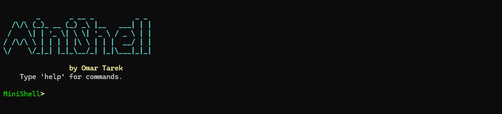
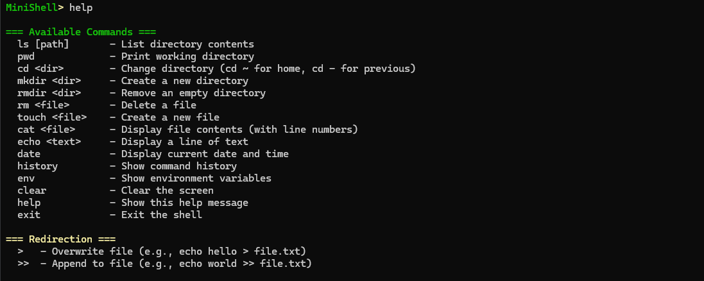

# MiniShell (College Project)

A feature-rich terminal shell written in C++ for Windows with colorful output and advanced commands.

## Screenshots



## Features

- 🎨 **Colorful Interface** - Enhanced visual experience with color-coded output
- 📁 **File Operations** - Create, delete, view files and directories
- 📝 **Command History** - Track up to 100 recent commands
- 🔄 **Output Redirection** - Support for `>` and `>>` operators
- 🏠 **Smart Navigation** - Support for `cd -` (previous dir) and `cd ~` (home dir)
- 📊 **Readable File Sizes** - Automatic conversion to KB/MB/GB

## Available Commands



### File & Directory Operations
- `ls [path]` - List directory contents with file sizes
- `pwd` - Print working directory
- `cd <dir>` - Change directory
- `mkdir <dir>` - Create a new directory
- `rmdir <dir>` - Remove an empty directory
- `rm <file>` - Delete a file
- `touch <file>` - Create a new file
- `cat <file>` - Display file contents with line numbers

### System Commands
- `echo <text>` - Display text (supports redirection)
- `date` - Display current date and time (12-hour format)
- `history` - Show command history
- `env` - Show environment variables (PATH formatted for readability)
- `clear` - Clear the screen
- `help` - Show all available commands
- `exit` - Exit the shell

### Redirection
- `>` - Overwrite file (e.g., `echo hello > file.txt`)
- `>>` - Append to file (e.g., `echo world >> file.txt`)

## Compilation

```bash
g++ -std=c++17 shell.cpp -o shell.exe
```

## Requirements

- Windows OS
- C++17 compiler (MSYS2/MinGW recommended)
- Windows API support

## Usage

Simply run the compiled executable:

```bash
./shell.exe
```

## Author

Omar Tarek

## License

Feel free to use and modify this project for educational purposes.
